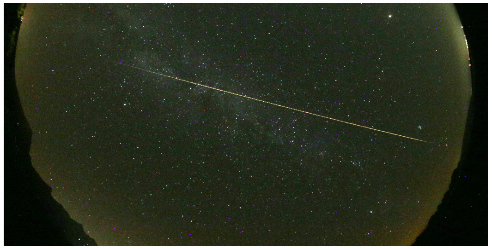
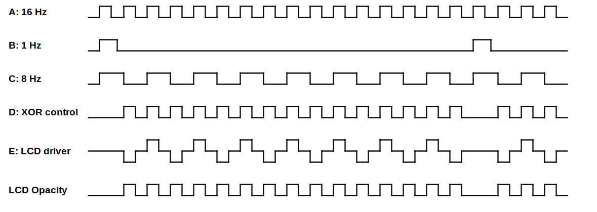
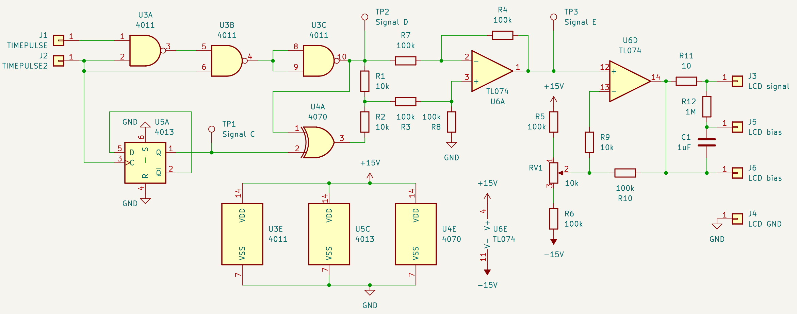

# gps-controlled-lcd-shutter

## Introduction

Photography of large meteoroids penetrating deeply into the Earth's atmosphere. Addition to traditional multi-station photography with periodic shutters for calculating the atmospheric trajectory and velocity of the meteoroid: add 1 Hz time markers to the waveform driving an LCD shutters. This creates additional reference points for comparing records from multiple stations. This technique was pioneered by the Ondřejov Observatory in the Czech Republic [reference needed].

## Required waveform

The required meteor obstruction pattern is visible from the photograph below (courtesy of the
Astronomical Institute of the Academy of Sciences of the Czech Republic).

When using an LCD shutter to realize the required pattern one needs an LCD opaqueness waveform  represented in the figure below.

## Reference design
Based on TIMEPULSE and TIMEPULSE2 signals from a Ublox Neo-M8T SoC.

## More simple and economical design
Based on an Arduino board.

## Documentation

- [Programming the Arduino Nano module](./doc/arduino-programming.md)
- [Measuring with an Arduino Oscilloscope](./doc/arduino-scope.md)
