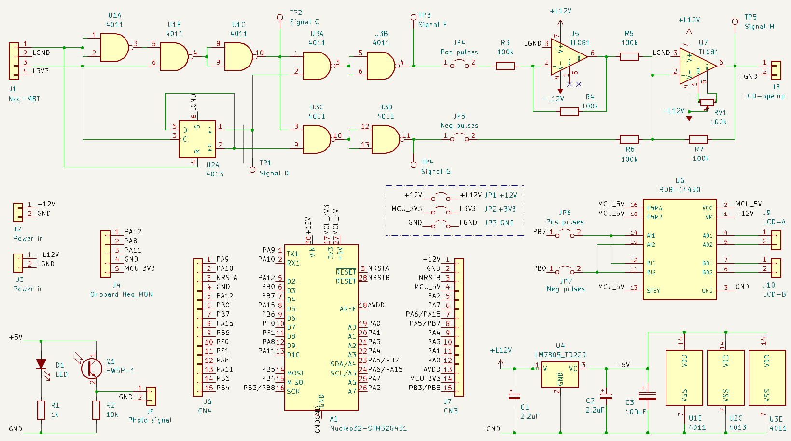

# gps-controlled-lcd-shutter

## Introduction

The GPS-controlled LCD shutter is used for photography of bright meteors. Traditionally, periodic shutters are applied in multi-station photography for aiding the calculation of the atmospheric trajectory and velocity of a meteoroid. The controlling system documented in this git repository adds 1 Hz time markers to the waveform driving an LCD shutter. These markers are synchronized with the highly accurate time signal of a GPS module. The markers function as additional reference points for comparing records from multiple stations. The technique was pioneered by the Ondřejov Observatory in the Czech Republic, see: [https://link.springer.com/article/10.1007/s11038-017-9511-z](https://link.springer.com/article/10.1007/s11038-017-9511-z).

The required pattern for obstructing the light passing through the camera lens is visible from the photograph below (courtesy of the Astronomical Institute of the Academy of Sciences of the Czech Republic).

## Reference design

When using an LCD shutter to realize the required pattern one needs an LCD opaqueness waveform represented as signal I in the figure below. The end of a long part of the meteor trail - or the rising edge of the first pulse of a pulse train in signal I - occurs a N + 2/32 seconds exactly.

The waveform required to drive the LCD shutter has both a 16 Hz signature for the periodic interruptions and a 1 Hz signature for the second markers. The Ublox Neo-M8T SoC is able to deliver both signals with high precision on its TIMEPULSE and TIMEPULSE2 outputs (signals A and B). Because of this high precision, the design with Neo-M8T is designated as the reference design.

Apart from the frequencies involved, there are additional requirements for driving an LCD shutter:

- although an LCD shutter becomes opaque when a voltage is put on it in either direction, it is advised to change the polarity of the applied voltage with each cycle to avoid degradation of the display (signal H)
- upon switching, the shutter draws a relatively high peak current of 28 mA during a short time

These requirements make that the LCD-shutter is better not driven by logical outputs directly. Rather, the reference design applies opamps to convert the logical signals into +/- 12V with a sufficiently low output impedance, see the top part of the electronic circuit below. The final opamp adds the inverted signal F to the signal G to create signal H. The electronic circuit for the final opamp includes a variable resistor RV1 to set the "inactive" output voltage to exactly 0V for maximum transparency of the LCD shutter.

For converting signals A and B into signals F and G, a few CMOS NAND ports and a D-flipflop are applied. Note that the 1 Hz signal is also fed into the reset port of the flipflop to have the edges of the 8 Hz signals D and E coincide with the rising edge of the 1 Hz signal.

## Optimized design

Although the reference design guarantees a high timing precision, it has significant drawbacks:

- the Neo-M8T is 10 times more expensive than its more nimble Neo-M8N sibling and dominates the production costs of the system
- the Neo-M8T is not available on a breakout board with the TIMEPULSE and TIMEPULSE2 output signals, so this requires high-precision soldering on 1 mm spaced SMD output pins
- the opamp circuit requires positive and negative power supplies
- the opamp circuit is hard to get stable and can only barely supply the peak current of the LCD shutter

Presenting the reference design to two different audiences resulted in valuable feedback to optimize the design:

- the required waveforms can also be produced by a microcontroller such as the Arduino board, by only using the 1 Hz output signal of a GPS module and using the internal, less precise clock of the microcontroller to obtain the 16 Hz timing information (see [this contribution to the repository](https://github.com/hadoopmarc/gps-controlled-lcd-shutter/commit/29299f46e7cd1bd2d8dd73f03644191cccfc6193)). Now, the cheaper Neo-M8N suffices to provide the 1 Hz timing data.
- an H-bridge module - often used to drive a DC motor - seems also suitable to drive the LCD shutter. An H-bridge only requires a positive power supply and can deliver high output currents.

This feedback resulted in the final optimized design, displayed on the lower part of the electronic circuit diagram. As the LCD shutter is already driven with a 16 Hz frequency, the H-bridge PWM duty cycle has a fixed setting of 100%. An H-bridge has two modes for a low output voltage, see the truth table below: short circuit the output pins ("Short brake" in motor terms) or disconnect the output pins ("Free run until frictional stop" in motor terms). It turns out that the LCD shutter needs the short circuit so that it can release its internal charge/polarity and become transparent as fast as possible.

The required input signals to the H-bridge are displayed in the waveform diagram below. Also in this design, the end of a long part of the meteor trail - or the rising edge of the first pulse of a pulse train in the LCD opacity signal - occurs a N + 2/32 seconds exactly.

## Validation of the designs

Proper operation of both designs can be validated with an [Arduino Oscilloscope](./doc/arduino-scope.md) and the small LED + phototransistor setup of the lower left part of the electronic circuit diagram.

The two oscilloscope diagrams above display signals F and G (yellow lines) simultaneously measured with the Pulse Per Second signal of the Neo-M8T module  (configured with a pulse duration of 50 ms). The pulse duration of signals F and G is 46875 ms (16 Hz with a duty cycle of 75% in case of a missing GPS satellite lock). The first diagram shows that the pulse at the start of a second is missing, as required.

In this image the yellow line represents the light throughput of the LCD shutter while driven by the reference design. The light is interrupted (sharp falling edges) at the start of a driver pulse (pulses not visible). There is no sharp falling edge coinciding with the rising edge of the GPS Pulse Per Second signal and the shutter can fully open. Note that these measurements were made with the cheap first generation LC-TEC shutters and that the measured opening response is consistent with [Figure 8.6 of their specifications](https://www.lc-tec.se/wp-content/uploads/2019/05/FOS_FOS-AR-specification-1602.pdf). Also note that the light transmission of the odd and even pulses is not exactly equal, indicating that the opamp driver circuit is not exactly balanced.

Again the light throughput against the GPS Pulse Per Second signal, but now for the optimized design with Neo-M8N, an Arduino and an H-bridge. Now, the GPS pulse has a duration of 100 ms and the duty cycle of the driver pulses is 50%, which gives the LCD-shutter more time to open than in the earlier image for the reference design.

This picture looks boring, but its significance is high. It displays the reference and optimized designs operating simultaneously with independent GPS receiver modules, both with a satellite lock. The white line shows signal F from the reference design, while the yellow line shows the H-bridge IN1 signal of the optimized design. This demonstrates that within the measuring accuracy of the oscilloscope used, the edges of the signals coincide.

This picture is a more attractive-looking variation on the picture above, again combining measurements from two independently operating setups. Here, signal F from the reference design (white line) is combined with the light throughput of the LCD shutter driven by the optimized design (yellow line). Also, here the opening and closing instances of the LCD-shutter nicely coincide with the falling and rising edges of signal F. Note that the measurements in the last two images were made with the electronic circuits built on a printed circuit board, while previous more noisy images were from circuits built on a breadboard. Also, a different phototransistor and LCD-shutter were used, explaining the slightly different light throughput curve, compared to the earlier images.

## Phase measurements in the optimized design

Apart from validation measurements of the output signals of the electronic circuits, it is also possible to use internal measurements from the microcontroller as a form of validation. The controlling software generates the pulses using timer interrupts. The timer period is chosen such that the end of a pulse train occurs at a phase difference Δt just before the ideal time instance required by the nanosecond precision GPS time. For an Arduino Nano microcontroller the timer has a limited resolution and as a result Δt has a stable value between 0 and 128 microseconds. How to monitor this phase difference and phase stability is described [here](./doc/arduino-programming.md).

## Further documentation

- [Programming the Arduino Nano module](./doc/arduino-programming.md)
- [Measuring with an Arduino Oscilloscope](./doc/arduino-scope.md)
- [Datasheets of system components](./doc/datasheet.md)
