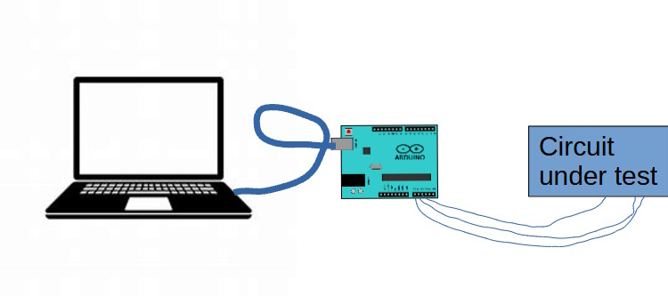

# Measuring Digital Signals with an Arduino Oscilloscope

Checking the proper working of an electronic circuit that produces and outputs
various signals (time dependent voltages), requires an oscilloscope or digital analyzer. For the low frequency control signals in the GPS-controlled LCD shutter project it is possible, though, to program an Arduino microcontroller as an oscilloscope.

The oscilloscope scripts in this project are based on an original project, published [here](https://www.instructables.com/Arduino-Oscilloscope-poor-mans-Oscilloscope/).

## Overview

Using the Arduino as an oscilloscope requires a dedicated Arduino board
that runs a measuring script, see the figure below. So, when your circuit to be measured contains an Arduino itself, the total setup involves two Arduino boards.

To connect the Arduino scope to the circuit under test, three wires are needed.
One wire connects the ground planes (GND). The remaining two wires carry the
signals to be measured. They run from the A0 and A1 analog input ports of
the Arduino scope to two measuring points on the circuit under test.

The PC/laptop runs an oscilloscope display program (to be explained later)
and triggers on the A0 signal only. So, it is a good idea to have the lower
frequency signal on the A0 port of the Arduino oscilloscope.

| ⚠️⚠️⚠️ WARNING ⚠️⚠️⚠️                                                           |
|:--------------------------------------------------------------------------------|
| Be sure that: -0.5V < `input voltage` < +5.5 V, or your Arduino may get damaged |

## Programming the Arduino

The recipe for programming the Arduino with a measuring the script is the same as [programming it with the LCD-shutter driver script](./arduino-programming.md). The only difference is the file location: 'gps-controlled-lcd-shutter/arduino/oscilloscope/oscilloscope.ino'. After uploading the script you will see the TX LED on the Arduino board lighting up continuously, because it sends new measurements all the time over the USB serial link.

## Installing the Processing IDE

The Processing IDE is a simple, but multi-platform programming environment that is suitable to use together with the Arduino IDE, because they share the design philosophy and support the same basic c language. Moreover, an example script for an oscilloscope was already available, see the link in the introduction.

The Processing IDE can be downloaded [here](https://processing.org/download). It is a portable archive (for use on managed PC's in education), so installation on Windows involves:

- unpack the zip file somewehere in your Home area, e.g. C:\Users\Name\Lib
- to start the IDE, double-click on `processing-4.3\processing.exe`
- optionally, by right-clicking on `processing-4.3\processing.exe` you can add attach it to the Microsof Windows start menu
- optionally, when double-clicking on a .pde file, you can select `processing-4.3\processing.exe` as the preferred program to open .pde files.

## Running the Oscilloscope Processing Script

To run the oscilloscope script from the GPS-controlled LCD shutter, find the file `gps-controlled-lcd-shutter\arduino\processing_oscilloscope\processing_oscilloscope.pde` and open it. Wait before you run the script and follow these steps:

- switch to the Arduino IDE running the oscilloscope measuring script and display the list of active COM ports. Note the ordinal number in this list (starting from 0) of the COM port that connects to the Arduino (showing a ✔). So, if there is just one COM port active, this ordinal number is `0`. Now close the Aruino IDE, freeing the COM port for other applications on your laptop.
- switch back to the Processing IDE and scroll to line `43`. Now, in the code part `Serial.list()[1]` replace the `1` in this fragment with the ordinal number noted in the previous step, if needed
- now you can push the RUN button of the Processing IDE and after a while a graphic window will pop up, showing the signals of the circuit under test according to the wires connected to the measuring Arduino
- once the signals are present on the display it is possible to freeze the signals by pushing the `p` button (pause). Pushing the `p` again allows new measurements to come in. The pause mechanism uses a 0/1 transition on the A0 input port of the Arduino as a trigger and it also shows some part of the signal preceding this trigger
- For the GPS-controlled LCD shutter, the GPS PPS signal is the most suitable to use as the A0 trigger signal. On the PCB it is available as the D2 pin, the fifth pin of the J6 connector. Most interesting to measure with the A1 input of the measuring Arduino, is the J5 signal pin of the phototransistor measuring the light intensity visible through the LCD shutter.